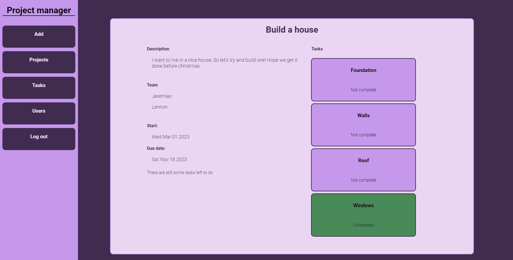
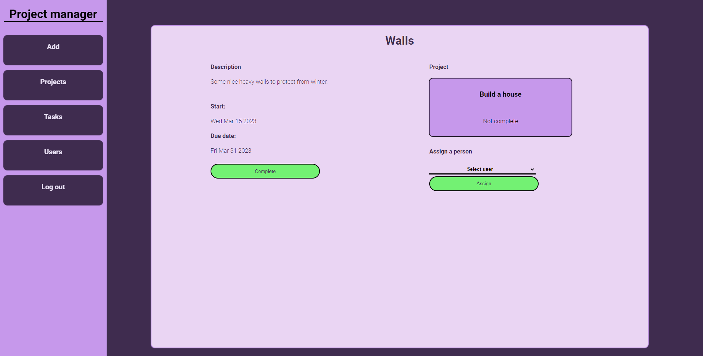
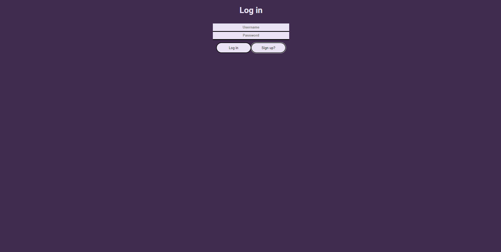

# super-project-manager

For ORM I used Dapper.

## Features

It's just a prototype and has a lot of things to improve. Mostly this was done as practicing purposes to see if I can create something little more complex than a basic todo list
It has logig and register functionality using JWT authentication, passwords are hashed into the db. Idea is that one instance of this app is one "team". You can add projects and tasks inside those projects.  
When creating a project you assign a team for it and then individually assing a task to a user. My idea was that a task should be so simple it can be done by one person.

## Notes to myself

I didn't use enough generics on the backend which made a lot of the code repetitive.  
Also my REST api knowledge wasn't on point when designing this so it doesn't fully commit on those guidelines

## Getting it to run

You'll need to have postgres installed on your machine. Use the sql file in backend folder with pg_dump to create the database. Set up appsettings so that the connectionstrings:default field has correct information. For frontend you want to install dependencies with npm install. With dotnet use dotnet restore. Frontend doesn't have ENV set up so the backend url needs to be set manually. (It should work if you're using the default host for dotnet application)

### Project

### Task

### Login

